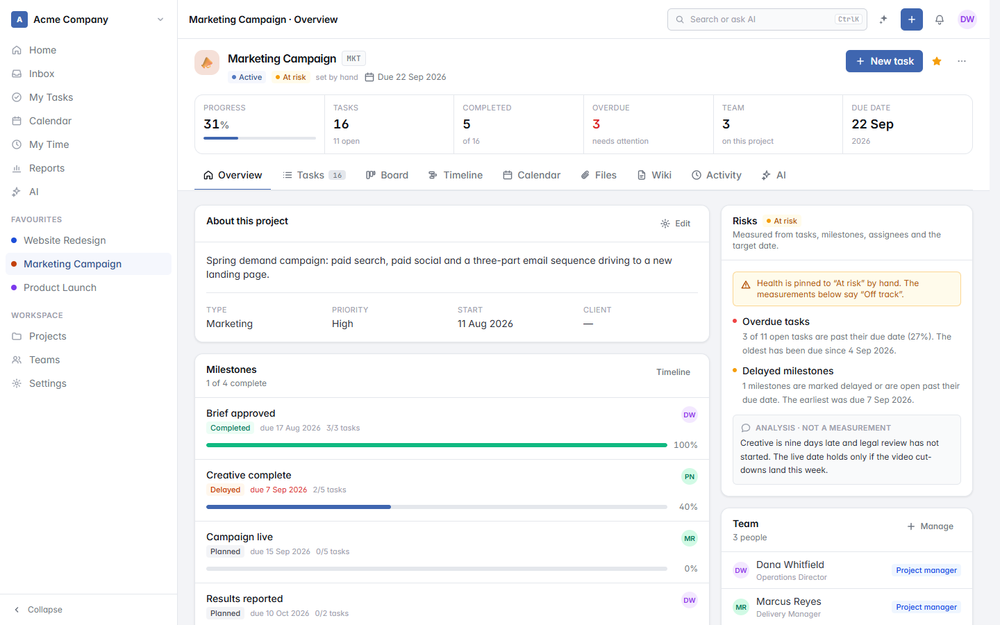
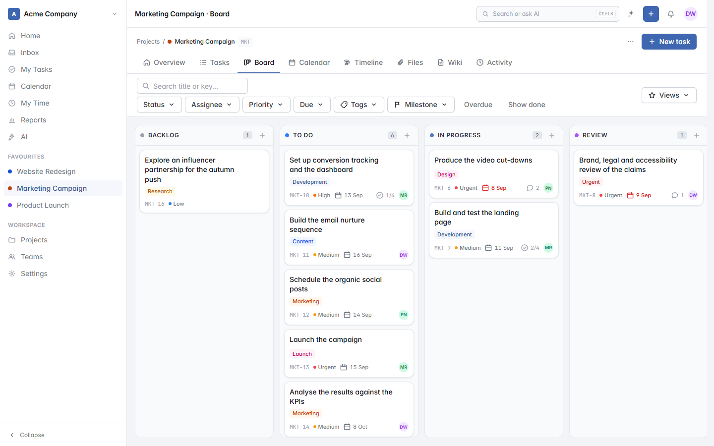
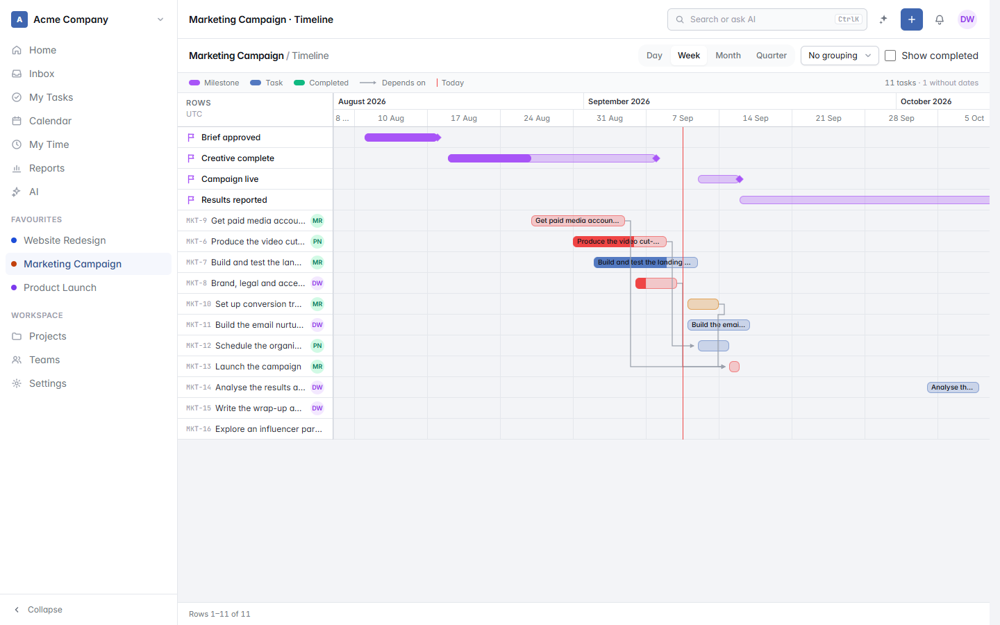
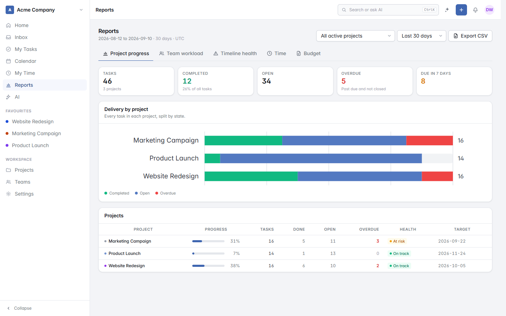
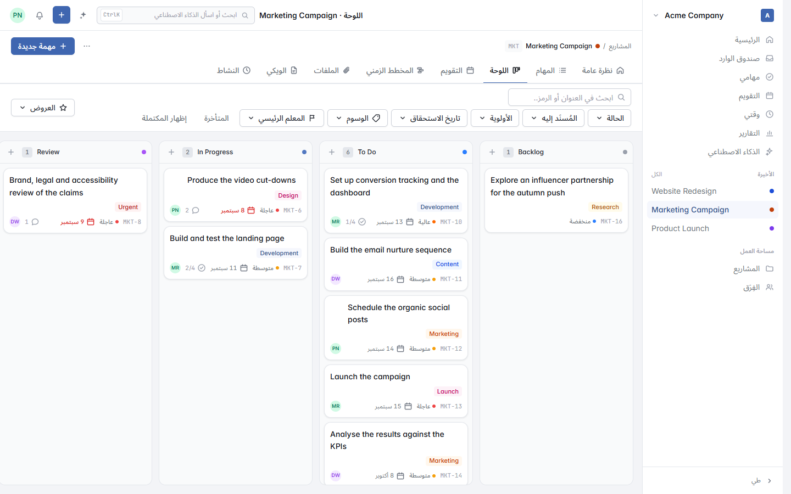

<p align="center">
  
  
</p>

<p align="center"><strong>Plan the work. Let AI run it.</strong></p>

<p align="center">
  An open-source, self-hosted project management platform for real businesses —
  installed from your browser, running on ordinary shared hosting.
</p>

<p align="center">
  <a href="LICENSE"></a>
  <a href="https://github.com/hatemsweileh/planvio/releases"></a>
  
  
  
  
</p>

<p align="center">
  
  
</p>

---

## What Planvio is

A general-purpose business project-management platform — not a software issue tracker that
happens to be usable for other things. It is built for marketing campaigns, construction,
events, product launches, HR initiatives, client work, operations and research.

There are two ways to work in it.

**By hand.** Projects, tasks, milestones, dependencies, boards, timelines, calendars, time
tracking, budgets, documentation, reports. Everything you would expect, designed to be fast
and quiet rather than busy.

**By AI.** Planvio exposes its own functionality to an AI agent through a governed tool
layer. Ask a question and it answers from your real data. Ask it to do something and it
does — creating tasks, reassigning work, moving dates, writing status reports, flagging
risk — through exactly the same permission checks, policies and audit trail a person goes
through. Turn it off and nothing else changes.

It ships in **English and Arabic**, with full right-to-left support, and an administrator
can add and translate further languages from inside the application.

---

## The part that is different

Most tools bolt a chat box onto a sidebar. Planvio treats AI as an operating layer with
real authority and real limits.

| | |
|---|---|
| **Acts as you, never above you** | Every AI action runs through the same `Gate`, policy and workspace scope as a human. There is no service account, no elevated mode, no raw database access. A permission denial is reported, not routed around. |
| **Three modes you choose** | **Assistant** answers and changes nothing. **Copilot** proposes each action and waits for approval. **Autonomous** executes within limits you set, per workspace and per project. |
| **Tools, not prompts** | 39 explicit tools with typed schemas. Each validates input, checks authorization, asserts workspace scope, runs a real application action inside a transaction, and writes an audit record. |
| **Untrusted content stays untrusted** | Task descriptions, comments, wiki pages and imported rows reach the model wrapped in `<untrusted-data>`. Instruction-shaped text inside your own records is data, not a command. |
| **Every action is auditable** | *Planvio AI changed status* and *Hatem changed status* are visually distinct, and every tool call is recorded with its arguments, result, risk level, approval state and the user whose authority it used. |
| **A real kill switch** | One control halts autonomous execution immediately without disabling the rest of Planvio. |

Bring your own model. Planvio talks to OpenAI, Anthropic, any OpenAI-compatible endpoint
(Azure, OpenRouter, Groq, Together, Mistral) and local runtimes such as Ollama, LM Studio
and vLLM. Nothing is sent anywhere you did not configure.

---

## A look at it

Every screenshot below is the demo workspace `php artisan planvio:demo` installs, so you
can have the same thing in front of you in about a minute.

### A project

Health is measured from the work — overdue tasks, delayed milestones, the target date — and
a manager can override it. When the two disagree, the project says so rather than quietly
preferring one: *health is pinned to "At risk" by hand; the measurements say "Off track"*.
Anything the assistant writes is labelled **analysis, not a measurement**, in the same
panel as the figures it is talking about.

<p align="center">
  
</p>

### Board

Drag and drop across your own statuses. Keys, assignees, due dates, tags, priorities and
subtask progress on the card, so the board answers most questions without opening anything.

<p align="center">
  
</p>

### Timeline

Dependencies as arrows, milestones as diamonds, a today marker, and four zoom levels.
Overdue work is red on the bar rather than in a separate report you have to go and read.

<p align="center">
  
</p>

### Reports

Progress, workload, timeline health, time and budget. Every chart carries a hidden data
table with the same figures, so a screen reader gets the numbers rather than a description
of a picture.

<p align="center">
  
</p>

### English and Arabic, properly

Not a translated string file over a left-to-right layout. The whole interface mirrors: the
sidebar moves to the right, the board runs right to left, chevrons and progress reverse,
dates are written in Arabic — while a Latin task title or a key like `MKT-8` keeps its own
direction inside the sentence it sits in.

<p align="center">
  
</p>

---

## Deploying it

Planvio installs on ordinary cPanel shared hosting in about fifteen minutes, entirely
through a browser and File Manager.

```
1.  Download planvio-v1.0.0.zip from Releases
2.  Upload it to your hosting account
3.  Extract it
4.  Point your domain's document root at planvio/public
5.  Create a MySQL database and user
6.  Open your domain in a browser
7.  Complete the installation wizard
8.  Add the scheduler cron job
9.  Add the queue worker cron job
10. Configure SMTP
11. Optionally configure AI
12. Sign in and start
```

You never touch a command line, never edit `.env`, and never run Composer.

Full walkthrough: **[docs/CPANEL.md](docs/CPANEL.md)**

### Requirements

| | |
|---|---|
| PHP | 8.3 or 8.4 |
| Extensions | `bcmath ctype curl fileinfo gd json mbstring openssl pdo pdo_mysql tokenizer xml` |
| Database | MySQL 5.7+ / MariaDB 10.6+ |
| Web server | Apache or LiteSpeed (Nginx supported — see [DEPLOYMENT.md](docs/DEPLOYMENT.md)) |
| Cron | Two entries |
| Disk | ~350 MB plus your attachments |

### What Planvio deliberately does *not* need

No Docker. No Kubernetes. No Redis. No RabbitMQ. No Elasticsearch. No PostgreSQL.
No Supervisor. No systemd. No Node.js in production. No npm in production. No Composer in
production. No root. No SSH.

The release archive ships `vendor/` and compiled frontend assets. Queues run on the database
and are drained by a short-lived cron worker. Nothing has to stay running.

---

## Running it from source

```bash
git clone https://github.com/hatemsweileh/planvio.git
cd planvio

composer install
npm install
npm run build

cp .env.example .env
php artisan key:generate
php artisan migrate --seed
php artisan planvio:demo        # optional sample workspace

php artisan serve
```

Then open `http://127.0.0.1:8000`. See [docs/DEVELOPMENT.md](docs/DEVELOPMENT.md) for the
architecture, conventions and how to add a model, an action, a policy or an AI tool.

---

## Features

<details>
<summary><strong>Work management</strong></summary>

Projects with types, health, budgets, custom statuses and templates · Tasks with subtasks,
checklists, dependencies, watchers, recurrence and custom fields · Milestones · Tags ·
Bulk operations · CSV import and export
</details>

<details>
<summary><strong>Views</strong></summary>

Kanban board with drag and drop · List with sorting, filtering, column control and saved
views · Calendar (month, week, day) · Timeline / Gantt with dependencies and zoom levels ·
My Tasks (today, upcoming, overdue, completed)
</details>

<details>
<summary><strong>Collaboration</strong></summary>

Rich-text comments with mentions, replies, reactions and attachments · Per-project wiki ·
Activity history · In-app and email notifications · Inbox · Per-user notification
preferences
</details>

<details>
<summary><strong>Delivery and money</strong></summary>

Time tracking with a timer and manual entries · Project budgets and expenses · Progress,
workload, timeline-health, time and budget reports · Printable project status report
</details>

<details>
<summary><strong>Teams and access</strong></summary>

Multiple isolated workspaces · Five workspace roles plus project-level roles · A project
manager can fully run their projects without being an administrator · Guest access scoped
to named projects · Teams and departments · Invitations
</details>

<details>
<summary><strong>AI</strong></summary>

Global assistant, per-project and per-task assistants · Command palette · Natural-language
task creation · Project planning and generation · Risk and health analysis · Report and
document generation · Task decomposition · Meeting-note processing · Scheduled and
event-driven automations · Approval queue · Conversation history · Usage visibility ·
Full audit trail
</details>

<details>
<summary><strong>Languages</strong></summary>

English and Arabic ship, with complete right-to-left layout, Arabic typography and a
vendored Arabic typeface · Administrators can add a language, translate it in-app with
placeholder validation, import and export JSON for external translators, and optionally
have the configured AI model draft a first pass for a human to review
</details>

<details>
<summary><strong>Platform</strong></summary>

Browser installer · Administration panel · System information and health checks ·
Maintenance mode · Audit log · Two-factor authentication · REST API (`/api/v1`) with
Sanctum tokens · Signed webhooks · Light, dark and system themes
</details>

---

## Documentation

| Document | For |
|---|---|
| [INSTALLATION.md](docs/INSTALLATION.md) | Installing Planvio anywhere |
| [CPANEL.md](docs/CPANEL.md) | The no-SSH cPanel walkthrough |
| [CLOUDLINUX.md](docs/CLOUDLINUX.md) | PHP Selector, LVE limits, CageFS |
| [DEPLOYMENT.md](docs/DEPLOYMENT.md) | Nginx, Apache, permissions, production hardening |
| [CRON.md](docs/CRON.md) | The scheduler and what depends on it |
| [QUEUE.md](docs/QUEUE.md) | Database queues without a daemon |
| [UPGRADING.md](docs/UPGRADING.md) | Versioning and the upgrade procedure |
| [SECURITY.md](docs/SECURITY.md) | Threat model and hardening |
| [LOCALISATION.md](docs/LOCALISATION.md) | Languages, RTL, and adding your own |
| [API.md](docs/API.md) | REST API reference |
| [AI.md](docs/AI.md) | Setting up and using the AI layer |
| [AI_SECURITY.md](docs/AI_SECURITY.md) | How the AI is contained |
| [AI_AUTONOMOUS_MODE.md](docs/AI_AUTONOMOUS_MODE.md) | Running Planvio autonomously, safely |
| [ARCHITECTURE.md](docs/ARCHITECTURE.md) | The internal architecture contract |
| [DEVELOPMENT.md](docs/DEVELOPMENT.md) | Working on Planvio itself |
| [LIMITATIONS.md](docs/LIMITATIONS.md) | What Planvio 1.0 deliberately does not do |

Start with [LIMITATIONS.md](docs/LIMITATIONS.md) if you are evaluating Planvio. It states
plainly what it does not do, and why, before you deploy rather than after.

---

## Contributing

Contributions are welcome. Please read [CONTRIBUTING.md](CONTRIBUTING.md) first — it covers
the architecture contract, the conventions the codebase holds itself to, and how to run the
test suite.

Found a security issue? Do not open a public issue. See [SECURITY.md](SECURITY.md).

---

## Built with

[Laravel 13](https://laravel.com) · [Filament 5](https://filamentphp.com) ·
[Livewire 4](https://livewire.laravel.com) · [Alpine.js](https://alpinejs.dev) ·
[Tailwind CSS 4](https://tailwindcss.com) · [TipTap](https://tiptap.dev) ·
[SortableJS](https://sortablejs.github.io/Sortable/) · MySQL / MariaDB

Filament powers the administration area and the form and table primitives. The product
itself is purpose-built — Planvio is not an admin panel with a project-management theme.

---

## Licence

Planvio is free software, licensed under the
**[GNU Affero General Public License v3.0](LICENSE)**.

You may run it, study it, modify it and share it. If you modify Planvio and make it
available to others over a network, the AGPL requires you to offer them the source of your
modified version. That is the whole point: everyone who relies on Planvio keeps the freedom
to see and change what they rely on.

*Planvio* and the Planvio logo are trademarks of Hatem Sweileh. The licence covers the
code, not the name or the mark — you are free to fork, but please give your fork its own
identity.

Copyright © 2026 Hatem Sweileh.
